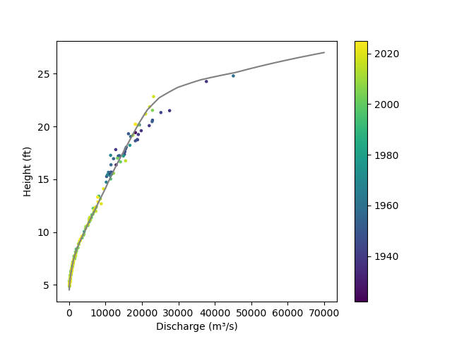

# pbml-scioto-iris
Codes for the Physics based Machine Learning Model for Scioto River for IRiS Fellowship

# Setting Up

## Install Python
use python 3.12 as tensorflow doesn't have support for 3.13 yet (as of writing this).

If you already have Python 3.13 in your system you can use `pyenv` to run different python version than your system and make virtual environments for them.

## Install required packages

Use the following commands to install required python packages for the project. The versions are frozen for reproducibility.

```bash
pip install -r requirements.txt
```

## Download Input Data
We are using streamflow data from USGS, and Precipitation data from https://storms2.storms.ohio.gov/ website. You can download the data from them following the scripts in the `download` directory. You'll need more libraries and setup (selenium for browser automation) for this.

You can also simply use the downloaded and processed data provided with the repository on the `processed` directory and skip those process.

If you want to download data yourself, follow these steps:
### Precipitation Data
Precipitation data were not easy to dowload as there was no clear cut API from the site. So we used `selenium` to automate a browser to download the stations details as well as the precipitation data.

### Streamflow Data
For streamflow, download the data through USGS website: https://dashboard.waterdata.usgs.gov/app/nwd/en/

Here, if you zoom into the map near scioto river, you can see a bunch of streamflow stations. The one that is close to the city is station: 03227500

https://dashboard.waterdata.usgs.gov/api/gwis/2.1.1/service/site?agencyCode=USGS&siteNumber=03227500&open=110328

And to fill the gaps in this, we used the streamflow data for stations upsteam and downstream of it.

For the initial analysis of the network and range of data, streamflow was downloaded for the following list of stations. You can follow the same steps to get all of them.
```python
["03217424", "03219500", "03220000", "03221646", "03225500",
 "03227107", "03228300", "03228689", "03228805", "03229610",
 "03217500", "03219781", "03221000", "03223425", "03226800",
 "03227500", "03228500", "03228750", "03229500"]
```

# Running scripts
## Download Raw data
If you use the data from `data` directory skip this step, the raw data are in subdirectories, but the scripts here will start by downloaded the raw data.

The script `src/download-precip.py` can be run interactively to open a browser and remotely control it using python. The codes there can extract the stations co-ordinates, which can be put in a GIS software to find the stations that are useful, and the second part will use that list and download the precipitation data for those stations.

The results from this steps are the CSV files in `data/streamflow` and `data/precip/raw`.

## Processing Raw Data
The raw data for streamflow and precipitation are not hourly so we need to work on that.

### Streamflow
For streamflow, out of all the input data, there are different time range and the frequency.

The processing is done with `src/streamflow-pre-process.py` script. It loads the station `03227500`, then loads two input nodes, and one output node.

Using `pandas` we took the 15 minutes interval irregular data into 1 hr regular data. We limit the interpolation to max of 2 hour (8*15min). Then we use the catchment area ration method to fill the station data from inputput and output nodes.

The output of this step is the file `data/streamflow-filled.csv`

### Precipitation
Precipitation data is more weird as it is supposed to be accumulated data, but there is no regular resetting of the accumulation date. So, algorithms were used to automatically detect the reset points, and some visualization and manual checks and edits were required.

The output of this step are files: `data/precip-and-sf.csv` and `data/precip-hourly.csv`

## Running the clustering algorithm

The `src/clustering.py` file has the code for clustering of the precipitation stations. We look at the correlation between stations. Then do PCA transformation and Kmeans algorithm to find the clusters. Using the Knee Locator, we found 5 clusters in the precipitation stations.


# Future Steps

## Converting it to Stage
We have streamflow prediction, but we need the stage prediction for us to be able to know the flood situation.

We have the actual measurements of discharge and streamflow from USGS, as well as the rating curve used by them.

The figure below shows the field measurements, and the grey line shows the rating curve from USGS.



